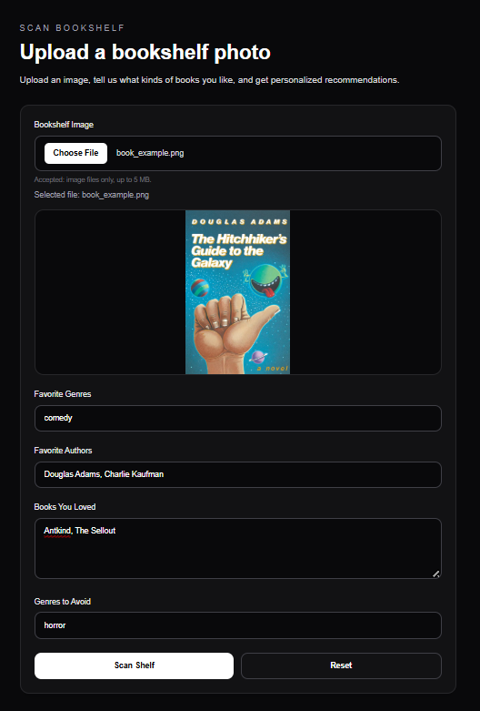
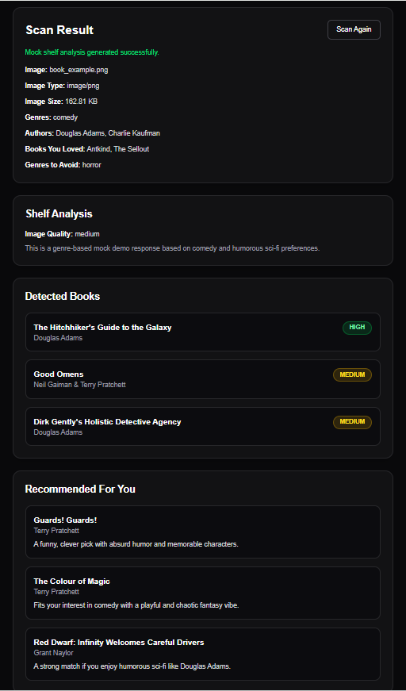

# 📚 Shelf Scanner — Smart Book Recommendation App

A full-stack web app that analyzes a user's bookshelf photo and preferences to generate personalized book recommendations.

This project demonstrates end-to-end product development using modern web technologies, including file uploads, API handling, and dynamic UI rendering.

---

## 🚀 Features

- 📷 Upload a bookshelf image
- 🧠 Enter reading preferences (genres, authors, favorite books, dislikes)
- ⚙️ Backend API processes input and generates results
- 📊 Displays:
  - Image metadata
  - Sample detected books
  - Personalized recommendations
- 🎨 Clean, responsive UI with Tailwind CSS
- 🔄 Reset / Scan again functionality
- ⏳ Loading overlay for better UX

---

## 🧩 Tech Stack

**Frontend**
- Next.js (App Router)
- React
- Tailwind CSS

**Backend**
- Next.js API Routes
- FormData handling

---

## 🧠 How It Works

1. User uploads an image and enters preferences
2. Data is sent to `/api/scan`
3. Backend processes input and generates mock analysis
4. UI displays:
   - Uploaded image details
   - Sample detected books
   - Recommendations based on user input

⚠️ Note: This version uses **genre-based mock logic** (no AI yet)

---

## 📂 Project Structure
shelf-scanner/
├── app/
│ ├── api/scan/route.ts # Backend logic
│ ├── page.tsx # Main page
│
├── components/
│ └── ScanForm.tsx # Main UI component
│
├── public/
├── styles/
├── README.md

---

## 💡 Example Logic

- If user enters **comedy / Douglas Adams**:
  → Returns humorous sci-fi recommendations

- If user enters **mystery / thriller**:
  → Returns suspense-based books

- If user enters **fantasy**:
  → Returns fantasy recommendations

---

## 🧪 Running the Project

```bash
cd shelf-scanner
npm install
npm run dev

Open: http://localhost:3000

⚠️ Known Limitations
No real image recognition yet
Uses mock dataset instead of AI model
No database or persistent storage

🔮 Future Improvements
Integrate OpenAI / Vision API for real book detection
Add OCR for spine text recognition
Store user history
Add authentication
Improve recommendation accuracy

🎯 Why This Project Matters

This project demonstrates:

Full-stack development (frontend + backend)
Real-world product thinking
API design and data flow
UX improvements (loading states, reset flows)
Scalable architecture for future AI integration


## 📸 Preview





This is a [Next.js](https://nextjs.org) project bootstrapped with [`create-next-app`](https://nextjs.org/docs/app/api-reference/cli/create-next-app).

## Getting Started

First, run the development server:

```bash
npm run dev
# or
yarn dev
# or
pnpm dev
# or
bun dev
```

Open [http://localhost:3000](http://localhost:3000) with your browser to see the result.

You can start editing the page by modifying `app/page.tsx`. The page auto-updates as you edit the file.

This project uses [`next/font`](https://nextjs.org/docs/app/building-your-application/optimizing/fonts) to automatically optimize and load [Geist](https://vercel.com/font), a new font family for Vercel.

## Learn More

To learn more about Next.js, take a look at the following resources:

- [Next.js Documentation](https://nextjs.org/docs) - learn about Next.js features and API.
- [Learn Next.js](https://nextjs.org/learn) - an interactive Next.js tutorial.

You can check out [the Next.js GitHub repository](https://github.com/vercel/next.js) - your feedback and contributions are welcome!

## Deploy on Vercel

The easiest way to deploy your Next.js app is to use the [Vercel Platform](https://vercel.com/new?utm_medium=default-template&filter=next.js&utm_source=create-next-app&utm_campaign=create-next-app-readme) from the creators of Next.js.

Check out our [Next.js deployment documentation](https://nextjs.org/docs/app/building-your-application/deploying) for more details.


