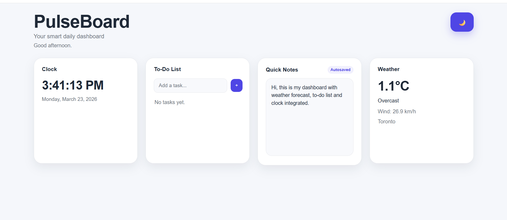

# PulseBoard — Smart Daily Dashboard

A clean and customizable dashboard that combines productivity and utility tools into one interface.

##  Features

- Live clock with dynamic greeting
- To-do list with add, delete, and completion tracking
- Quick notes (autosaved using LocalStorage)
- Weather integration (Open-Meteo API)
- Drag-and-drop widget layout
- Light / Dark mode toggle
- Persistent data (saved in browser)

## Preview



## Tech Stack

- HTML
- CSS
- JavaScript
- LocalStorage
- REST API (Open-Meteo)

## How to Run

1. Clone the repository:
   ```bash
   git clone https://github.com/yourusername/pulseboard-dashboard.git